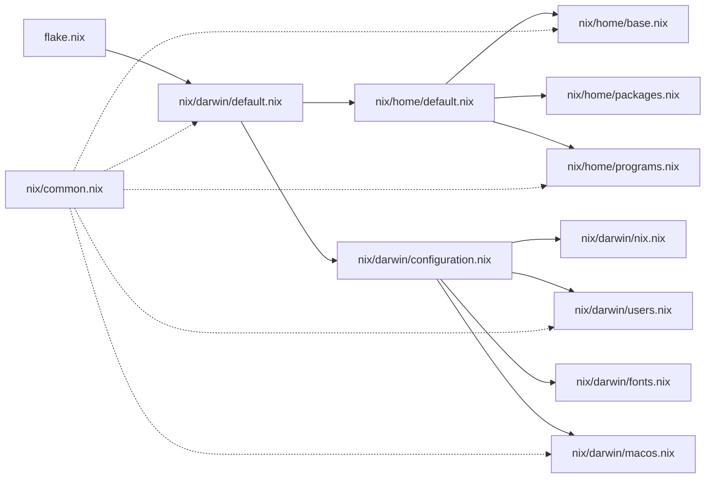

# nix-darwin
Manage your macOS using Nix

## Initial Setup

### 1. Configure Personal Information

Before using this configuration, you must create your personal configuration file:

```zsh
# Copy the template
cp nix/common.nix.template nix/common.nix

# Edit with your information
nvim nix/common.nix
```

Fill in your personal details:
- `username`: Your macOS username
- `homeDirectory`: Your home directory path
- `hostname`: Your Mac's hostname
- `gitUserName`: Your git commit name
- `gitUserEmail`: Your git email

**Note**: `nix/common.nix` is tracked by git (required for Nix flakes to evaluate it), but uses `git update-index --skip-worktree` to prevent future changes from being committed. This keeps your personal information local while satisfying flake requirements.

If you need to modify this file on a new machine:
1. Copy and edit: `cp nix/common.nix.template nix/common.nix`
2. The file is already tracked, so nix-darwin will work immediately
3. Your local changes will not appear in `git status` or be committed

## Prerequisites

Follow the steps in the [nix-darwin/nix-darwin#getting-started](https://github.com/nix-darwin/nix-darwin?tab=readme-ov-file#getting-started).

```zsh
sudo mkdir -p /etc/nix-darwin
sudo chown $(id -nu):$(id -ng) /etc/nix-darwin
cd /etc/nix-darwin

# To use Nixpkgs unstable:
nix flake init -t nix-darwin/master
# To use Nixpkgs 25.05
nix flake init -t nix-darwin/nix-darwin-25.05

```

Install `nix-darwin`

```zsh
sudo nix --extra-experimental-features "nix-command flakes" run nix-darwin/master#darwin-rebuild -- switch
```

Backup `/etc/zshrc` and `/etc/bashrc`

```zsh
sudo mv /etc/bashrc /etc/bashrc.before-nix-darwin
sudo mv /etc/zshrc /etc/zshrc.before-nix-darwin
```

And run

```zsh
sudo darwin-rebuild switch
```


## Linking

```zsh
$ sudo mv /etc/nix-darwin/flake.nix ./                                                                                                                          main
Password:
$ nvim flake.nix                                                                                                                                                main
$ sudo mv /etc/nix-darwin/configuration.nix ./                                                                                                                  main
$ nvim configuration.nix                                                                                                                                        main
$ sudo rm -rf /etc/nix-darwin                                                                                                                                   main
$ sudo ln -s ~/github/nix-darwin /etc/nix-darwin                                                                                                              main
$ ls -l /etc/nix-darwin
```

## Overview




## Architecture

This configuration follows established Architecture Decision Records (ADRs) for maintainability and clarity:

- **[ADR 0001](docs/adr/0001-module-organization.md)**: Module Organization Principles
- **[ADR 0002](docs/adr/0002-separation-of-concerns.md)**: Separation of Concerns (darwin vs home-manager)
- **[ADR 0003](docs/adr/0003-dependency-management.md)**: Dependency Management Strategy
- **[ADR 0004](docs/adr/0004-configuration-patterns.md)**: Configuration Patterns and Best Practices

See [docs/adr/README.md](docs/adr/README.md) for the complete ADR index.

## Troubleshooting

### Managing nix/common.nix

The `nix/common.nix` file uses git's `skip-worktree` feature to stay tracked (for Nix flakes) while preventing local changes from being committed.

**To check skip-worktree status:**
```zsh
git ls-files -v | grep common.nix
# "S" prefix means skip-worktree is enabled
```

**To temporarily disable skip-worktree (e.g., to restore from git):**
```zsh
git update-index --no-skip-worktree nix/common.nix
git restore nix/common.nix
git update-index --skip-worktree nix/common.nix
```

**To view differences between your local file and git version:**
```zsh
git update-index --no-skip-worktree nix/common.nix
git diff nix/common.nix
git update-index --skip-worktree nix/common.nix
```

## Memo

### Nix import syntax

```nix
let
  myModule = import ./path/to/myModuleDirectory; # This will import ./path/to/myModuleDirectory/default.nix
in
  myModule.someAttribute
```
