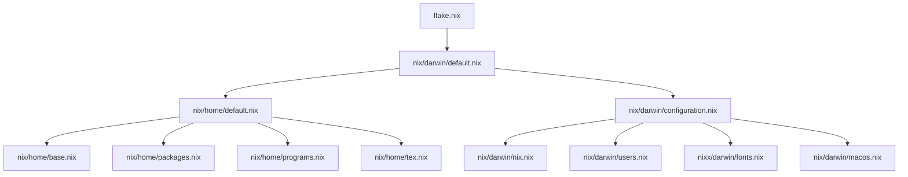

# nix-homebrew
Manage your macOS using Nix

## Prerequisites

Follow the steps in the [nix-darwin/nix-darwin#getting-started](https://github.com/nix-darwin/nix-darwin?tab=readme-ov-file#getting-started).

```zsh
sudo mkdir -p /etc/nix-darwin
sudo chown $(id -nu):$(id -ng) /etc/nix-darwin
cd /etc/nix-darwin

# To use Nixpkgs unstable:
nix flake init -t nix-darwin/master
# To use Nixpkgs 25.05
nix flake init -t nix-darwin/nix-darwin-25.05

```

Install `nix-darwin`

```zsh
sudo nix --extra-experimental-features "nix-command flakes" run nix-darwin/master#darwin-rebuild -- switch
```

Backup `/etc/zshrc` and `/etc/bashrc`

```zsh
sudo mv /etc/bashrc /etc/bashrc.before-nix-darwin
sudo mv /etc/zshrc /etc/zshrc.before-nix-darwin
```

And run

```zsh
sudo darwin-rebuild switch
```


## Linking

```zsh
$ sudo mv /etc/nix-darwin/flake.nix ./                                                                                                                          main
Password:
$ nvim flake.nix                                                                                                                                                main
$ sudo mv /etc/nix-darwin/configuration.nix ./                                                                                                                  main
$ nvim configuration.nix                                                                                                                                        main
$ sudo rm -rf /etc/nix-darwin                                                                                                                                   main
$ sudo ln -s ~/github/nix-darwin /etc/nix-darwin                                                                                                              main
$ ls -l /etc/nix-darwin
```

## Overview



```mermaid
graph TD;
  A0[flake.nix] --> B0[nix/darwin/default.nix];
  A1[nix/darwin/configuration.nix] --> B1[nix/darwin/nix.nix];
  A1 --> C1[nix/darwin/users.nix];
  A1 --> D1[nixx/darwin/fonts.nix];
  A1 --> E1[nix/darwin/macos.nix];
  A2[nix/home/default.nix] --> B2[nix/home/base.nix];
  A2 --> C2[nix/home/packages.nix];
  A2 --> D2[nix/home/programs.nix];
  A2 --> E2[nix/home/tex.nix];
  B0 --> A2;
  B0 --> A1;
```

## Memo

### Nix import syntax

```nix
let
  myModule = import ./path/to/myModuleDirectory; # This will import ./path/to/myModuleDirectory/default.nix
in
  myModule.someAttribute
```
